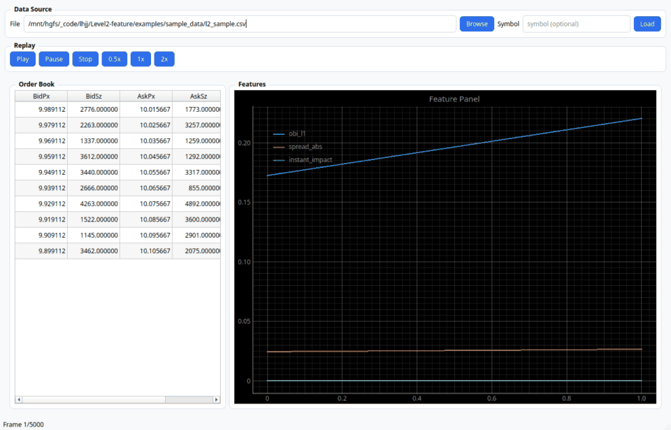

# l2-features

[](https://github.com/laoyu17/Level2-Feature/actions/workflows/ci.yml)

`l2-features` 是一个面向 Level2/Tick 高频数据的开源微观结构特征提取工具。项目重点是：

- 高性能离线计算（Polars/Arrow）
- 在线增量特征更新（Stream Updater）
- 可演示的 PyQt6 回放与特征面板
- 可复用工程规范（CLI + CI + 回归测试 + 文档）

> 仓库地址：`https://github.com/laoyu17/Level2-Feature.git`

## 适合用于简历展示的亮点

1. 处理 Level2 大数据并输出标准化特征表
2. 同时支持 batch 与 stream 两种计算模式
3. 提供性能基准命令，可量化吞吐表现
4. UI 可直接用于面试现场演示“数据回放 + 特征变化”

## 演示录屏



## 功能清单（MVP）

- 盘口类：`obi_l1/obi_l5/obi_l10`、`spread_abs`、`microprice`、`book_slope`
- 行为类：`cancel_intensity`、`add_cancel_ratio`、`order_flow_imbalance`
- 成交类：`trade_sign_imbalance_20`、`instant_impact`、`amihud_proxy`
- 波动类：`rv_20/rv_100/rv_500`
- 回放模式：`batch-playback` / `stream-playback`

## 安装

```bash
python -m pip install -e .
```

开发依赖：

```bash
python -m pip install -e .[dev]
```

UI 依赖：

```bash
python -m pip install -e .[ui]
```

> 如果你的 Python 版本暂不支持 numba，可先不安装 perf 扩展，不影响主流程。

## 快速开始

### 1) 校验 Schema

```bash
l2f validate-schema --input examples/sample_data/l2_sample.csv
```

> 说明：L2+ 深度列需按档位完整成组出现（`bid_px_i/bid_sz_i/ask_px_i/ask_sz_i`），并保持连续。

### 2) 离线批处理特征提取

```bash
l2f compute \
  --input examples/sample_data/l2_sample.csv \
  --output outputs/features.parquet \
  --depth-levels 10
```

> `trade_sign` 优先读取 `side`（支持 `-1/0/1`、`B/S`、`BUY/SELL`），无法解析时回退价格推断。

### 3) 流式回放（增量特征）

```bash
l2f replay \
  --input examples/sample_data/l2_sample.csv \
  --speed 1.0 \
  --limit 2000 \
  --output outputs/replay.parquet
```

### 4) 性能基准

```bash
l2f benchmark \
  --input examples/sample_data/l2_sample.csv \
  --rows 200000 \
  --mode both
```

### 5) 启动 GUI

```bash
l2f ui
# 或
l2f-ui
```

> UI 默认 `batch-playback`，可在界面中切换到 `stream-playback` 以查看增量特征路径。

## 工程规范

- 提交规范：Conventional Commits（`feat/fix/perf/refactor/test/docs/chore`）
- 分支策略：`main` + `feat/*` + `fix/*`
- 合并前要求：lint + unit/integration + regression + perf smoke
- 文档更新：行为变更必须同步更新 `docs/changelog.md`

## 数据合规说明

本仓库默认使用公开样例与模拟数据，不包含任何受限商业行情。接入私有数据时，请增加适配层并确保脱敏与授权合规。
